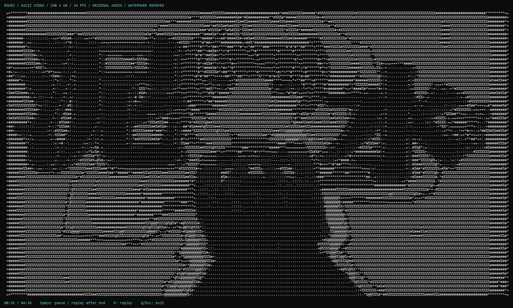

# Rorikami_ASCII

在 Windows PowerShell 中播放带原音轨的 ASCII 字符视频，支持黑白和彩色显示。预转换视频和音频已包含在仓库中，下载后即可播放。



## 开始播放

1. 下载仓库 ZIP 并解压，或运行 `git clone https://github.com/MisakiMei-hub/Rorikami_ASCII.git`。
2. 双击 `Play-Ascii.cmd` 播放黑白版本，或双击 `Play-Ascii-Color.cmd` 播放 16 色版本。
3. 使用 `Alt + Enter` 切换全屏；窗口大小变化时，字符画面会自动铺满可用区域，底部保留一行操作提示。

播放只需要 Windows 自带的 PowerShell；无需安装 Python、FFmpeg 或额外播放器。建议使用 Windows Terminal 和 Consolas 等常规等宽字体。

也可以在项目目录的 PowerShell 中运行：

```powershell
powershell.exe -NoProfile -ExecutionPolicy Bypass -File .\Play-Ascii.ps1
```

## 操作

| 按键 | 功能 |
| --- | --- |
| 空格 | 暂停 / 继续；播放结束后从头重播 |
| R | 随时从头重播 |
| Q / Esc | 退出播放器 |
| Alt + Enter | 切换终端全屏 |

播放结束后保留最后画面，并显示 `ENDED / Space: replay`。通过 `.cmd` 启动时，退出播放器后 PowerShell 窗口仍会保留。

## 可选参数

```powershell
# 彩色播放
powershell.exe -NoProfile -ExecutionPolicy Bypass -File .\Play-Ascii.ps1 -Color

# 静音播放前 10 秒，并在预览结束后退出播放器
powershell.exe -NoProfile -ExecutionPolicy Bypass -File .\Play-Ascii.ps1 -Mute -PreviewSeconds 10

# 检查所有字符帧和音频文件
powershell.exe -NoProfile -ExecutionPolicy Bypass -File .\Play-Ascii.ps1 -Verify

# 导出第 840 帧（约 35 秒处）为 ASCII 文本
powershell.exe -NoProfile -ExecutionPolicy Bypass -File .\Play-Ascii.ps1 -SnapshotFrame 840 -SnapshotPath .\snapshot.txt
```

## 视频处理与同步

- 时长约 4 分 34 秒，240×68 字符，24 帧/秒。
- 转换时去除原片右上角固定水印，并自动裁掉黑边。
- 默认按窗口宽高铺满画面；窗口比例不同时，画面比例会随之改变。
- Windows 原生 MCI 播放 PCM 音频，画面按音频进度同步，暂停和重播同时作用于画面与声音。

## 重新转换

只有重新生成字符视频时才需要 Python、NumPy、Pillow 和可从命令行调用的 FFmpeg / FFprobe。Python 3.11 为已验证环境。

```powershell
python -m pip install -r requirements.txt
python .\build_ascii.py --video "D:\素材\video.m4s" --audio "D:\素材\audio.m4s"
```

原始 `.m4s` 文件不包含在仓库中。转换器针对本项目的 640×360 原片和右上角水印位置设置；替换其他尺寸或水印位置的视频时，需要调整 `build_ascii.py` 中的滤镜。

## 项目文件

| 文件 | 用途 |
| --- | --- |
| `Play-Ascii.cmd` / `Play-Ascii-Color.cmd` | 双击启动入口 |
| `Play-Ascii.ps1` | PowerShell 播放入口 |
| `AsciiPlayer.cs` | 字符渲染、音频同步与键盘控制 |
| `movie.ascii.gz` | 已转换的字符帧及颜色数据 |
| `audio.wav` | 原音轨转换的 PCM 音频 |
| `movie.json` | 视频参数 |
| `build_ascii.py` / `requirements.txt` | 重新转换源码及依赖 |
| `preview.png` / `preview.txt` | 字符画面预览 |
